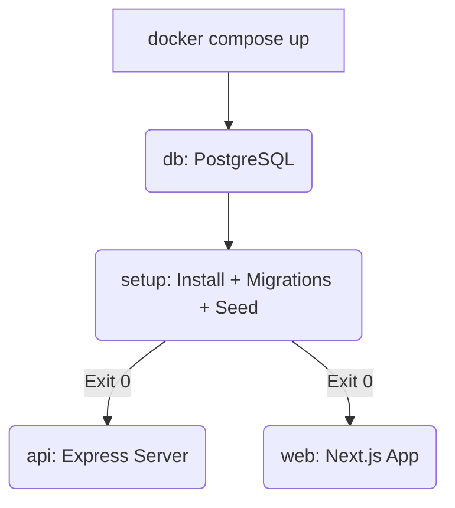

# 📄 Documentació Tècnica - Infraestructura Iter

Aquest document detalla l'arquitectura del sistema, la gestió de contenidors i les optimitzacions de rendiment aplicades al projecte.

## 🏗️ Arquitectura de Contenidors (Docker Compose)

El projecte utilitza un model de **serveis desacoblats** però orquestrats de forma seqüencial per garantir la consistència dels fitxers.

### 1. Serveis Principals
*   **`db`**: Instància de PostgreSQL 15. Utilitza un volum persistent (`postgres_data`) per mantenir les dades entre reinicis.
*   **`setup`**: Servei efímer que prepara l'entorn. S'encarrega d'executar `npm install`, `prisma generate`, `prisma db push` i `prisma db seed`.
*   **`api`**: Servidor Express que corre sobre Node 22. Executa el codi via `npx tsx` per a un desenvolupament ràpid.
*   **`web`**: Aplicació Next.js en mode `dev` amb el motor Turbopack activat.

### 2. Flux d'Arrencada Seqüencial
Per evitar errors de bloqueig de fitxers ("Text file busy") en sistemes Linux i garantir que els mòduls estan instal·lats abans d'iniciar les aplicacions, s'ha implementat:

## 📦 Gestió del Monorepo (Turborepo)

Turborepo és el motor que orquestra les tasques del monorepo.

*   **Pipeline de Tasques**: Definit a `turbo.json`. Gestiona dependències entre tasques (ex: no es pot fer `dev` sense haver fet `db:generate` primer).
*   **Filtratge**: Utilitzem la flag `--filter` per carregar només el codi necessari per a cada servei Docker, optimitzant l'ús de RAM.
*   **Hot-Reloading**: Els volúmenes sincronitzen en temps real el codi de l'host amb el contenidor, i `tsx` (API) o `Next.js` (Web) reinicien el procés automàticament.

## 💾 Gestió de Volums i Persistència

Hem optimitzat l'ús de volums per evitar la contaminació de l'espai de treball:

*   **`node_modules_cache`**: Un volum anònim i compartit que emmagatzema totes les dependències des de l'arrel. Això accelera dràsticament els reinicis.
*   **`postgres_data`**: Volum per a la persistència física de la base de dades.

## 🔌 Configuració de Xarxa i Ports

El projecte utilitza una xarxa interna anomenada `iter-network`. Els ports exposats s'han canviat respecte a configuracions anteriors per evitar col·lisions:

| Host Port | Container Port | Servei |
| :--- | :--- | :--- |
| 3000 | 3000 | API REST |
| 8002 | 3000 | Web UI |
| 8080 | 8080 | Adminer (Accés via http://localhost:8080) |
| 5432 | 5432 | PostgreSQL (Accés directe opcional) |

## 🚀 Optimitzacions de Desenvolupament (Premium)

1.  **`tsx` (TypeScript Execute)**: Substitueix `ts-node` pel backend, essent fins a 10 vegades més ràpid en l'arrencada i eliminant problemes de resolució de mòduls ESM.
2.  **Standalone Mode**: Next.js està configurat per generar paquets "standalone", preparat per a imatges de producció extremadament lleugeres.
3.  **Hoisting**: Totes les eines de desenvolupament (`typescript`, `turbo`, `nodemon`) estan al `package.json` de l'arrel per garantir versions úniques i evitar errors de "module not found".
