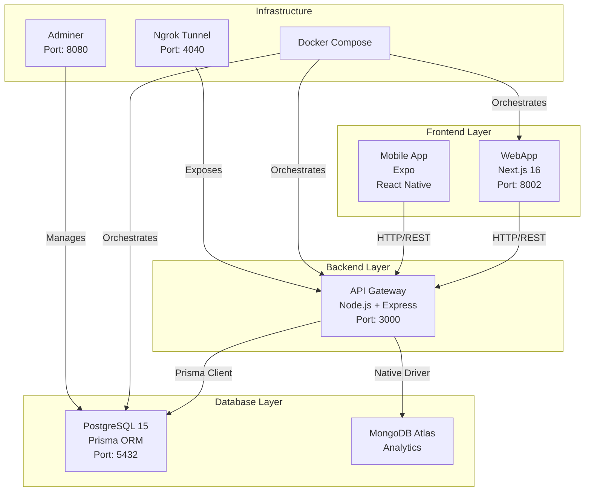
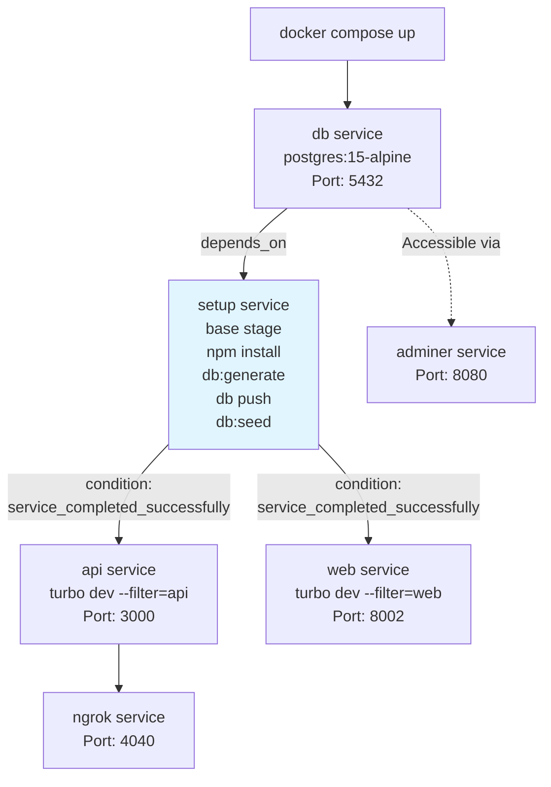
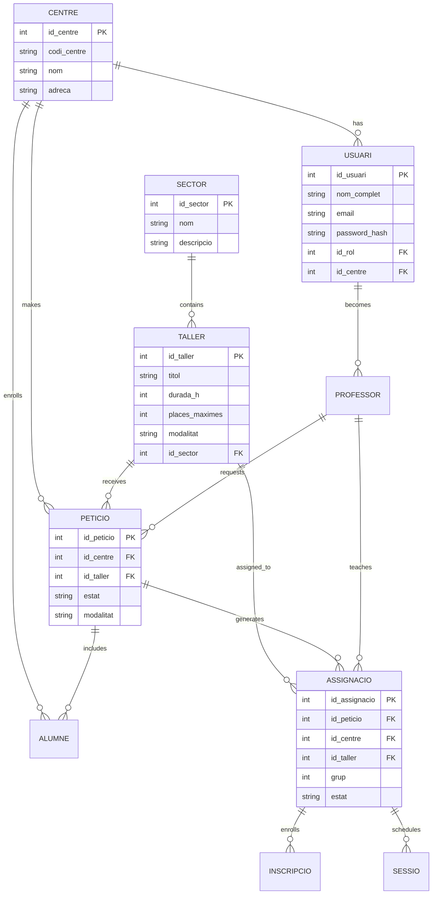
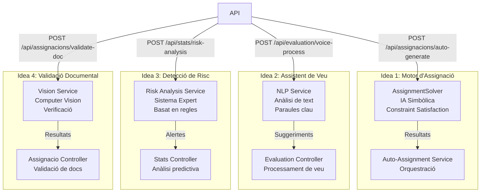
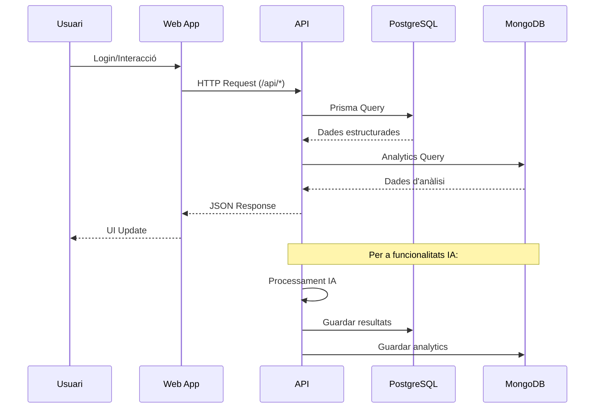
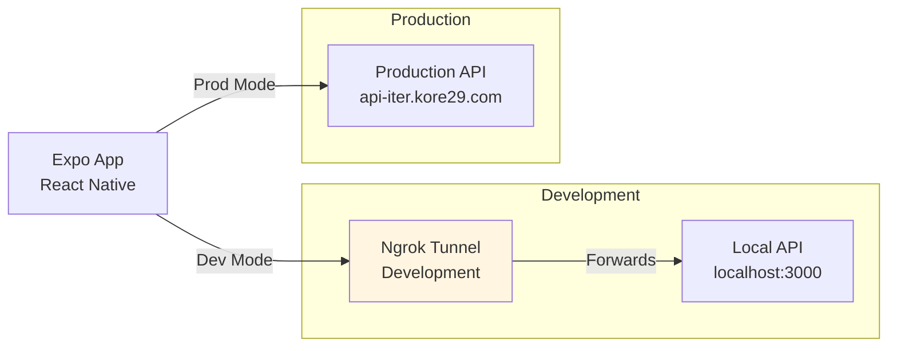
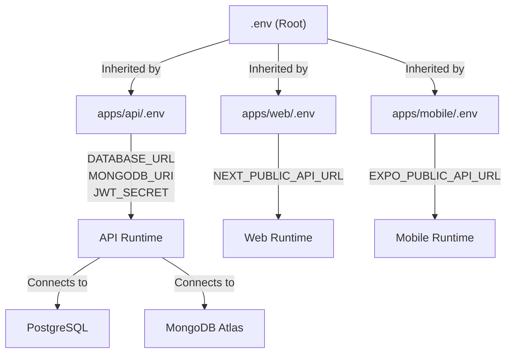

# Diagrames del Sistema ITER ECOSYSTEM


## 🏗️ Arquitectura General del Sistema



## 🐳 Flux de Docker Compose



## 🗄️ Esquema de Base de Dades Principal



## 🤖 Flux de Funcionalitats d'IA



## 🔄 Flux de Dades Complet



## 📱 Arquitectura Mobile



## 🔧 Configuració d'Entorn



---

## Notes

- **Arquitectura Monorepo**: El projecte utilitza Turborepo per gestionar múltiples aplicacions en un sol repositori [1](#0-0) 
- **Base de Dades Dual**: PostgreSQL per a dades estructurades amb Prisma ORM, MongoDB Atlas per a analytics [2](#0-1) 
- **Orquestració Docker**: Flux seqüencial amb servei setup dedicat per evitar conflictes [3](#0-2) 
- **Funcionalitats IA**: Quatre mòduls integrats amb diferents enfocaments (simbòlic, NLP, expert system, computer vision) [4](#0-3) 
- **Esquema de Dades**: Model relacional complex amb entitats principals com Centre, Usuari, Taller, Peticio, Assignacio [5](#0-4) 

Wiki pages you might want to explore:
- [Development Guide (inspedralbes/tr2-reptes-tr2-g2)](/wiki/inspedralbes/tr2-reptes-tr2-g2#9)

### Citations

**File:** README.md (L17-37)
```markdown
Benvingut al nucli de l'ecosistema **Iter**. Aquesta és una infraestructura moderna basada en un **Monorepo** gestionat amb **Turborepo**, dissenyada per ser escalable, ràpida i fàcil de desplegar.

> [!IMPORTANT]
> **ACTUALITZACIÓ ARQUITECTÒNICA (Gener 2026):**
> Hem implementat un nou flux d'arrencada seqüencial amb un servei de `setup` dedicat per garantir la màxima estabilitat i evitar conflictes de dependències en l'entorn Docker.

## 🌐 Entorn de Producció

L'ecosistema està totalment automatitzat i exposat de forma segura a través de **Cloudflare Tunnels**:

* **💻 Web UI (Client/Admin):** [iter.kore29.com](https://iter.kore29.com)
* **🔌 API Gateway:** [api-iter.kore29.com](https://api-iter.kore29.com)

## 🏗️ Estructura del Projecte

Utilitzem una arquitectura d'**espais de treball (workspaces)** per compartir codi eficientment:

* **`apps/web`**: Aplicació unificada de **Next.js 16** (amb Turbopack) que gestiona tant la interfície de client com el panell d'administració.
* **`apps/api`**: Backend robust en **Node.js 22** amb **Express, Prisma ORM** i execució optimitzada amb `tsx`.
* **`apps/mobile`**: Aplicació nativa multiplataforma amb **Expo** (iOS/Android).
* **`packages/shared`**: Llibreria de tipus i utilitats compartides entre el frontend i el backend.
```

**File:** apps/api/src/index.ts (L65-70)
```typescript
  try {
    await prisma.$queryRaw`SELECT 1`;
    logger.info(`🗄️  DATABASE STATUS: Connected to PostgreSQL`);
  } catch (e) {
    logger.error(`🗄️  DATABASE STATUS: Connection failed`);
  }
```

**File:** docker-compose.yml (L28-44)
```yaml
  # Service de Instalación y Setup (Premium Optimization)
  setup:
    build:
      context: .
      dockerfile: Dockerfile
      target: base
    working_dir: /app
    volumes:
      - .:/app
      - node_modules_cache:/app/node_modules
    command: sh -c "npm install && npx turbo db:generate --filter=api && npx prisma db push --accept-data-loss --schema=apps/api/prisma/schema.prisma && npx turbo db:seed --filter=api"
    env_file:
      - ./apps/api/.env
    depends_on:
      - db
    networks:
      - iter-network
```

**File:** doc/AI_features/DOCUMENTACION_IA_COMPLETA.md (L7-150)
```markdown
#  Idea 1: Motor d'Assignació Automàtica

Aquesta guia detalla pas a pas com implementar el motor d'assignació automàtica d'alumnes a tallers (Modalitat C), garantint l'heterogeneïtat i el compliment de restriccions.

## Workflow Simplificat (Lògica "Slots First")
El sistema segueix aquests passos lògics:
1.  **Càlcul de Places**: Si hi ha 50 alumnes apuntats a un taller, el sistema calcula quants grups de 16 es necessiten (50/16 = 4 grups).
2.  **Creació de "Cubs"**: Es generen 4 grups buits (Group ID 1, 2, 3, 4).
3.  **Distribució**: L'algorisme pren alumne per alumne i busca el millor "cub" on encaixar-lo, respectant que no hi hagi més de 4 del mateix institut en aquest cub.

## 1. Modificació de Base de Dades (Prisma)
**Arxiu**: `apps/api/prisma/schema.prisma`

Necessitem permetre que una petició es divideixi en múltiples grups i distingir aquests grups.

1.  **Afegir camp `grup`**: En el model `Assignacio`, afegir `grup Int @default(1)`.
2.  **Relació 1:N**: Canviar la relació amb `Peticio`. Una petició pot tenir *moltes* assignacions (una per cada grup generat).

```prisma
// Abans
model Assignacio {
  id_peticio Int? @unique
  // ...
}

// Després
model Assignacio {
  id_peticio Int? // S'elimina @unique
  grup       Int  @default(1)
  // ...
}

model Peticio {
  // ...
  assignacions Assignacio[] // Canvia de Assignacio? a Assignacio[]
}
```

**Comando a executar**:
```bash
npx prisma generate
npx prisma db push
```

## 2. Implementar Algorisme d'Assignació (AI)
**Arxiu**: `apps/api/src/services/assignment.solver.ts`

Crear la classe `AssignmentSolver` que conté la lògica matemàtica.
-   **Rep**: Llista d'estudiants i "Slots" (buits de taller amb capacitat i ID de grup).
-   **Restriccions**: Màxim 16 alumnes per Slot i màxim 4 alumnes d'un mateix centre per Slot.
-   **Estratègia**: Algorisme Greedy Aleatori (ordena estudiants a l'atzar i busca el millor slot disponible per maximitzar barreja).

## 3. Crear Servei d'Orquestració
**Arxiu**: `apps/api/src/services/auto-assignment.service.ts`

Aquest servei connecta la base de dades amb l'algorisme.
1.  Busca peticions aprovades (Modalitat C).
2.  Agrupa alumnes per Taller sol·licitat.
3.  Calcula quants grups necessaris (Total Estudiants / 16).
4.  Crida a `AssignmentSolver`.
5.  Guarda els resultats a BD creant registres a `Assignacio` i `Inscripcio`.

## 4. Exposar Endpoint a API
-   **Controlador**: `apps/api/src/controllers/assignacio.controller.ts` (`generateAutomaticAssignments`).
-   **Rutes**: `apps/api/src/routes/assignacio.routes.ts`.
-   **Endpoint**: `POST /api/assignacions/auto-generate`.

## 5. Ús
Per executar l'assignació automàtica, enviar una petició POST:
-   **URL**: `/api/assignacions/auto-generate`
-   **Header**: `Authorization: Bearer <token>`

## Preguntes Freqüents (Idea 1)
1.  **Quina IA utilitza?**: Utilitza una **IA Simbòlica d'Optimització** (Constraint Satisfaction Problem). No és una "xarxa neuronal", sinó un algorisme matemàtic que avalua combinacions per complir regles estrictes.
2.  **És automàtic o hi ha un botó?**: Funciona **amb un botó**. L'assignació es fa sota demanda quan l'administrador ho decideix.
3.  **Com verificar que funciona?**: Al panell de control, en veure la llista d'alumnes del taller, verificaràs que estan dividits en grups de màxim 16 i amb barreja d'instituts.

---

# 🎤 Idea 2: Assistent de Veu per Avaluació

Aquesta guia descriu els passos tècnics per integrar la funcionalitat de processament de veu/text per automatitzar l'avaluació competencial i el control d'assistència.

## Workflow Simplificat (Lògica NLP)
1.  **Recepció**: El professor dicta una frase: *"Juan ha arribat 10 minuts tard però està liderant molt bé el grup"*.
2.  **Transcripció**: El mòbil converteix l'àudio a text via STT natiu.
3.  **Anàlisi (Backend)**: El servei `NLPService` detecta patrons ("tard" -> `Retard`, "liderant" -> Competència Positiva).
4.  **Execució**: El sistema actualitza automàticament l'`Assistencia` i l'`AvaluacioCompetencial`.

## 1. Crear Servei NLP (Backend)
**Arxiu**: `apps/api/src/services/nlp.service.ts`
Busca paraules clau de puntualitat ("tard", "falta") i de competència ("ajuda", "lidera") per suggerir puntuacions.

## 2. Crear Controlador d'Avaluació
**Arxiu**: `apps/api/src/controllers/evaluation.controller.ts`
Aquest controlador busca la inscripció de l'alumne, fa `upsert` a `Assistencia` i crea el registre a `AvaluacioCompetencial` (vinculat a `AvaluacioDocent`).

## 3. Configurar Rutes de l'API
-   **Arxiu**: `apps/api/src/routes/evaluation.routes.ts`.
-   **Endpoint**: `POST /api/evaluation/voice-process`.
-   **Registre**: Assegurar-se d'incloure-ho a `apps/api/src/routes/index.ts`.

## 4. Ús des de Frontend (Simulació)
El frontend envia el `text`, `studentId`, `sessionId` i `assignacioId` a l'endpoint esmentat.

## Preguntes Freqüents i Limitacions (Idea 2)
1.  **I si hi ha dos "Juan"?**: El sistema requereix enviar el `studentId`. El professor dicta el text dins de la fitxa específica de l'alumne, evitant ambigüitat.
2.  **Com entén ironies?**: Aquesta versió utilitza paraules clau. Per a comprensió humana completa, es requeriria integrar un LLM (com GPT-4), la qual cosa té un cost per ús.
3.  **Funciona amb àudio gravat o text?**: L'API rep **text**. La conversió d'Àudio a Text la fa el mòbil del professor, la qual cosa és gratis i ràpida.

---

#  Idea 3: Detecció Predictiva de Risc

Aquesta guia descriu els passos tècnics per integrar el sistema de "Early Warning" per detectar alumnes amb alt risc d'abandonament.

## Workflow Simplificat (Lògica de Risc)
1.  **Recopilació**: Extreu les últimes 5 sessions d'assistència i avaluacions competencials.
2.  **Scoring**: 
    -   Absències (2+) -> +40 pts.
    -   Retards (2+) -> +10 pts.
    -   Baix rendiment (< 3) -> +10 pts per competència.
3.  **Classificació**: 0-30 Baix, 30-50 Mitjà, 50-80 Alt, 80-100 CRÍTIC.
4.  **Acció**: Genera una **Notificació Urgent** per al tutor de l'institut de procedència.

## 1. Crear Servei d'Anàlisi (Backend)
**Arxiu**: `apps/api/src/services/risk-analysis.service.ts`
Implementa la lògica de càlcul i disparament d'alertes.

## 2. Integrar en Controlador d'Estadístiques
**Arxiu**: `apps/api/src/controllers/stats.controller.ts`
Afegeix `runRiskAnalysis` per a execució individual o en lot (batch).

## 3. Configurar Rutes de l'API
**Arxiu**: `apps/api/src/routes/stats.routes.ts`
Endpoint: `POST /api/stats/risk-analysis`.

## 4. Automatització (Opcional)
Es recomana un **Cron Job** per executar aquesta anàlisi setmanalment (ex. Divendres tarda).

## Preguntes Freqüents (Idea 3)
1.  **Quina IA utilitza?**: Sistema Expert Basat en Regles. És lògica transparent i auditable.
2.  **Els punts es reinicien?**: L'assistència utilitza una **finestra mòbil** de 5 sessions. Si l'alumne millora, el risc baixa. Les avaluacions són acumulatives.
3.  **Quan s'envien alertes?**: En el moment de l'anàlisi.
```

**File:** apps/api/prisma/schema.prisma (L14-189)
```text
model Sector {
  id_sector  Int      @id @default(autoincrement())
  nom        String
  descripcio String?  @db.Text
  tallers    Taller[]

  @@map("sectors")
}

model Taller {
  id_taller      Int          @id @default(autoincrement())
  titol          String
  descripcio     String       @default("")
  durada_h       Int
  places_maximes Int          @default(25)
  modalitat      Modalitat
  icona          String       @default("🧩")
  id_sector      Int
  sector         Sector       @relation(fields: [id_sector], references: [id_sector])
  dies_execucio  Json         @default("[]")
  peticions      Peticio[]
  assignacions   Assignacio[]

  @@map("tallers")
}

enum Modalitat {
  A
  B
  C
}

// ==========================================
// 2. USUARIS I CENTRES
// ==========================================

model Centre {
  id_centre        Int     @id @default(autoincrement())
  codi_centre      String  @unique
  nom              String
  adreca           String?
  telefon_contacte String?
  email_contacte   String?

  usuaris       Usuari[]
  peticions     Peticio[]
  assignacions  Assignacio[]
  alumnes       Alumne[]      @relation("CentreProcedencia")
  professors    Professor[]
  incidencies   Incidencia[]
  notificacions Notificacio[]

  @@map("centres")
}

model Incidencia {
  id_incidencia Int      @id @default(autoincrement())
  id_centre     Int
  centre        Centre   @relation(fields: [id_centre], references: [id_centre])
  descripcio    String   @db.Text
  estat         String   @default("Pendent")
  data_creacio  DateTime @default(now())

  @@map("incidencies")
}

model Rol {
  id_rol  Int      @id @default(autoincrement())
  nom_rol String
  usuaris Usuari[]

  @@map("rols")
}

model Usuari {
  id_usuari     Int     @id @default(autoincrement())
  nom_complet   String
  email         String  @unique
  password_hash String
  url_foto      String?
  id_rol        Int
  rol           Rol     @relation(fields: [id_rol], references: [id_rol])
  id_centre     Int?
  centre        Centre? @relation(fields: [id_centre], references: [id_centre])

  assignacio_professors AssignacioProfessor[]
  logs                  LogAuditoria[]
  notificacions         Notificacio[]
  professor             Professor?
  sessioProfessors      SessioProfessor[]

  @@map("usuaris")
}

model Professor {
  id_professor Int     @id @default(autoincrement())
  nom          String
  contacte     String?
  id_centre    Int
  centre       Centre  @relation(fields: [id_centre], references: [id_centre])
  id_usuari    Int?    @unique
  usuari       Usuari? @relation(fields: [id_usuari], references: [id_usuari], onDelete: Cascade)

  peticions1 Peticio[]    @relation("Profesor1")
  peticions2 Peticio[]    @relation("Profesor2")
  assig1     Assignacio[] @relation("AssigProf1")
  assig2     Assignacio[] @relation("AssigProf2")

  @@map("professors")
}

// ==========================================
// 3. PETICIONS I ASSIGNACIONS
// ==========================================

model Peticio {
  id_peticio    Int          @id @default(autoincrement())
  id_centre     Int
  centre        Centre       @relation(fields: [id_centre], references: [id_centre])
  id_taller     Int
  taller        Taller       @relation(fields: [id_taller], references: [id_taller])
  alumnes_aprox Int?
  comentaris    String?      @db.Text
  data_peticio  DateTime     @default(now())
  estat         EstatPeticio @default(Pendent)
  modalitat     Modalitat?

  prof1_id Int
  prof1    Professor @relation("Profesor1", fields: [prof1_id], references: [id_professor])
  prof2_id Int
  prof2    Professor @relation("Profesor2", fields: [prof2_id], references: [id_professor])

  alumnes Alumne[] @relation("AlumnesPeticio")

  assignacions Assignacio[]

  @@index([estat])
  @@map("peticions")
}

enum EstatPeticio {
  Pendent
  Aprovada
  Rebutjada
}

model Assignacio {
  id_assignacio Int             @id @default(autoincrement())
  id_peticio    Int?
  peticio       Peticio?        @relation(fields: [id_peticio], references: [id_peticio])
  id_centre     Int
  centre        Centre          @relation(fields: [id_centre], references: [id_centre])
  id_taller     Int
  taller        Taller          @relation(fields: [id_taller], references: [id_taller])
  data_inici    DateTime?       @db.Date
  data_fi       DateTime?       @db.Date
  estat         EstatAssignacio @default(PUBLISHED)
  grup          Int             @default(1)

  prof1_id Int?
  prof1    Professor? @relation("AssigProf1", fields: [prof1_id], references: [id_professor])
  prof2_id Int?
  prof2    Professor? @relation("AssigProf2", fields: [prof2_id], references: [id_professor])

  professors   AssignacioProfessor[]
  checklist    ChecklistAssignacio[]
  inscripcions Inscripcio[]
  respostes    RespostesQuestionari[]
  enviaments   EnviamentQuestionari[]
  enquestes    Enquesta[]
  certificats  Certificat[]
  sessions     Sessio[]

  @@index([data_inici, data_fi])
  @@map("assignacions")
}
```
